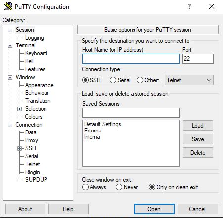

# ML Home Server
### v0.1.0

[](https://codecov.io/gh/sertemo/MLHomeServer)


## Descripción
Pequeño proyecto para montar un servidor en el ordenador Samsung del 2011 con **Xubuntu**.

La idea es poder utilizarlo como API para hacer predicciones con modelos de ML y devolver dichas predicciones.

Este proyecto ofrece además la posibilidad de entrenar modelos.

## Entrenar un modelo localmente
### 1. Configurar el archivo de desafíos config.yml dentro de la raiz del proyecto
Antes de entrenar un modelo hay que definir el desafío y los parámetros necesarios para el entrenamiento.

Se presupone que ya se han hecho las pruebas pertinentes y el análisis exploratorio para el desafío en los notebooks.

El objetivo del entrenamiento manual es tener alojado en el contexto del proyecto el modelo para lanzar las predicciones.

Para que el entrenamiento se realice correctamente hay que añadir los parámetros del **dataset**, del **preprocesador** del dataset y del **modelo** al archivo `config.yml` en la raiz principal del proyecto.

El formato del archivo es el siguiente:

```yml
[nombre_desafio]:  # El nombre del desafío en cuestión
  dataset:
    filename: [value]  # Nombre del archivo de train dentro de data/nombre_desafio
    label_col_name: [value]  # Nombre de la columna de los targets
    params:  # Parámetros a pasar al 'read_csv' para abrir correctamente el dataframe
      [param1]: [value]
  preprocessor:
    class_name: [value]  # Dentro de data_processing/nombre_desafio_transformer.py en este caso
    params:  # Estos serán los parámetros a pasar al preprocesador
      [parametro1]:  # Si hay que especificar una lista
        - "1"
        - "2"
        - "3"
      [parametro2]:
        - "objeto1"
        - "objeto2"
  model:
    type: [value]  # El módulo en el que se encuentra el modelo (tanto custom como de terceros)
    class_name: "Modelo"  # El nombre de la clase del modelo dentro del módulo 
    params:
      [parametro1]: [value]
      [parametro2]: [value]
  label_encoder: [true o false]
```

**Notas importantes**
- Será siempre necesario hacer un preprocesador personalizado y guardarlo en **ml/data_processing/nombre_desafio_transformer.py**
- El **preprocesador** debe tener un método `fit_transform`. o heredar de `TransformerMixin` del módulo `sklearn.base`.
- El archivo dataset para el entrenamiento debe estar guardado en la carpeta data dentro de una carpeta con el mismo nombre del desafío: **data/nombre_desafio/**.
- El modelo puede ser un modelo personalizado, en tal caso deberá guardarse en la carpeta **ml/models** y especificar el módulo en el que se encuentra y su nombre en el archivo config.yml.
- Para que sea válido el modelo debe tener los métodos `fit` y `predict`.
- En caso de usar un modelo de una librería como por ejemplo `sklearn` es necesario también especificar el módulo desde el que hay que importarlo y su nombre.


Un ejemplo de archivo para el desafío **aidtec** es el siguiente:

```yml
aidtec:
  dataset:
    filename: "train.csv"
    label_col_name: "calidad"
    params:
      index_col: 0
  preprocessor:
    class_name: "WineDatasetTransformer"
    params:
      drop_columns:
        - "year"
        - "color"
        - "alcohol"
        - "densidad"
        - "dioxido de azufre libre"
  model:
    type: "sklearn.ensemble"
    class_name: "RandomForestClassifier"
    params:
      n_estimators: 900
      random_state: 42
  label_encoder: true
```

### 2. Ejecutar train.sh
El entrenamiento se inicializa mediante el siguiente comando:

```sh
$ ./train.sh <nombre_desafio>
```

Para el proyecto **aidtec** el comando sería:
```sh
$ ./train.sh aidtec
```

Esto ejecutará el script `train.py` en la carpeta **ml/training** con el nombre del desafío como argumento.

El nombre del desafio debe coincidir con el nombre de desafío especificado en el archivo de configuración `config.yml`.

El algoritmo de entrenamiento mostrará por pantalla la evaluación del modelo usando CV con **5 splits** por defecto. Este parámetro se puede ajustar en `settings.py` dentro de **mlhomeserver/**.

Al finalizar el entrenamiento se mostrará la precisión media de los splits y se guardará tanto el modelo entrenado en formato `.joblib` como el label encoder en caso de haberlo en la carpeta **models/nombre_desafio** en el directorio raiz del proyecto.


----
## Docker 
### Pre requisitos
Antes de poder tener en funcionamiento la API en un docker en el lado del servidor, hay que instalar docker. Para ello se puede hacer preparando el siguiente script sacado de la [doc](https://docs.docker.com/engine/install/ubuntu/#install-using-the-repository) oficial:
```sh
# Setup del repositorio de Docker
# Add Docker's official GPG key:
sudo apt-get update
sudo apt-get install ca-certificates curl
sudo install -m 0755 -d /etc/apt/keyrings
sudo curl -fsSL https://download.docker.com/linux/ubuntu/gpg -o /etc/apt/keyrings/docker.asc
sudo chmod a+r /etc/apt/keyrings/docker.asc

# Add the repository to Apt sources:
echo \
  "deb [arch=$(dpkg --print-architecture) signed-by=/etc/apt/keyrings/docker.asc] https://download.docker.com/linux/ubuntu \
  $(. /etc/os-release && echo "$VERSION_CODENAME") stable" | \
  sudo tee /etc/apt/sources.list.d/docker.list > /dev/null
sudo apt-get update

# Instalar paquetes
sudo apt-get install docker-ce docker-ce-cli containerd.io docker-buildx-plugin docker-compose-plugin

# Verificar que haya ido ok
sudo docker run hello-world
```

Si se usa una distro tipo **Xubuntu**, **Mint** etc, poner `$UBUNTU_CODENAME` en lugar de `$VERSION_CODENAME`.

Después habrá que crear un volumen llamado `model-data`:
```sh
$ docker volume create model-data
```

Esto permitirá hacer que los modelos que entrenemos en el servidor sean persistentes.

Se ha creado un workflow en Github `docker.yml` que al hacer push realiza lo siguiente:
- Genera una nueva imagen
- Sube a mi DockerHub la imagen. Para realizar esto se han tenido que agregar a los **secrets** del repositorio tanto el **DOCKER_USERNAME** como el **DOCKER_PASSWORD**.

**Nota**:
- Se ha añadido un condicional a la creación de la imagen para que solo se ejecute si se detectan cambios en ciertas rutas.

La idea es crear un **cronjob** en el servidor que periódicamente descargue la última imagen de DockerHub correspondiente al repositorio y compruebe si ha habido cambios. Si ha habido cambios se construirá automáticamente un nuevo contenedor vinculando el volumen **model-data** para hacer que los modelos entrenados persistan. Esto se ejecutará mediante script por ejemplo asi:
```sh
$ docker run -d -p 5000:8000 -v model-data:/app/models mlhomeserver
```

También borrará el contenedor anterior.
```sh
$ docker rm nombre_contenedor
```

Si los cambios en el repo son porque se ha agregado un nuevo desafío (habrá que aumentar la versión en 1 en el minor) habrá que conectarse al servidor para entrenar el modelo.

### Acceso remoto al servidor mediante SSH
Para acceder al servidor remotamente primero habrá que tener instalado **OpenSSH**
```sh
$ sudo apt update
$ sudo apt install openssh-server
```

Verificar que el servidor esté corriendo y sino  iniciarlo:
```sh
$ sudo systemctl status ssh
$ sudo systemctl start ssh
```

Se puede habilitar el servicio **ssh** para que arranque automáticamente con el sistema:
```sh
$ sudo systemctl enable ssh
```
Por defecto el servicio está escuchando en el puerto **22**.
una vez tenemos el servicio corriendo tenemos que realizar de nuevo un **Port Forwarding** desde nuestro router para derivar por ejemplo cualquier conexión externa al puerto **2222** (el 22 estaba ocupado) a la ip privada del servidor en el puerto 22. De esta manera conectamos ambos canales.

Una vez hecho esto, podemos conectarnos a través de consola por ejemplo de **Git Bash** desde una ip exterior empleando ssh:

```sh
$ ssh <usuario_del_servidor>@trymlmodels.com:2222
```

Tras realizarse la conexión nos pedirá la contraseña del usuario.

Otra opción para conectarse desde **Windows** es utilizar [PuTTY](https://www.putty.org/).


Puede configurarse una sesión interna para conectarse desde casa usando la ip privada del servidor y otra sesión externa para conectarse al dominio trymlmodels.com a través del puerto 2222.

### Entrenar un modelo dentro de un contenedor docker
Para entrenar un modelo en docker primer hay que acceder al servidor. Se puede usar **ssh**.

Después habrá que acceder al contenedor:

Listar los contenedores que están corriendo actualmente:
```sh
$ docker ps
```

Una vez identificado el contenedor adecuado hay que meterse dentro. Desde **Windows** :
```sh
$ docker exec -it nombre_contenedor //bin/bash
```

Dentro de la consola ejecutar como si se estuviera en local:
```sh
$ ./train.sh nombre_desafio
```

Después se podría salir simplemente ejecutando:
```sh
$ exit
```

### Actualizar automáticamente los cambios en el servidor
Para actualizar los cambios en el contenedor Docker del servidor se preparará un **cronjob** que se ejecutará periódicamente. De momento empezaremos ejecuando el script 1 vez al día, a las **23:30** que hará lo siguiente:
1. Pull al repo de DockerHun donde está la imagen
2. Comparar la ID de la iamgen descargada con la imagen del contenedor en ejecución
3. Si la imagen es distinta se parará el contenedor
4. Se creará un contenedor nuevo

El script `update_docker.sh` puede ser algo así:
```sh
#!/bin/bash

# Configuración
IMAGE_NAME="sertemo/mlhomeserver:latest"
CONTAINER_NAME="mi_contenedor"
VOLUME_NAME="model-data"

# Hacer pull de la última imagen
docker pull $IMAGE_NAME

# Comprobar si el contenedor está corriendo
if docker ps -a --format '{{.Names}}' | grep -q "^${CONTAINER_NAME}$"; then
    # Obtener el ID de la imagen del contenedor en ejecución
    RUNNING_IMAGE=$(docker inspect --format='{{.Image}}' $CONTAINER_NAME)

    # Obtener el ID de la última imagen
    LATEST_IMAGE=$(docker inspect --format='{{.Id}}' $IMAGE_NAME)

    # Comparar los IDs de imagen
    if [ "$RUNNING_IMAGE" != "$LATEST_IMAGE" ]; then
      echo "Nueva imagen detectada, actualizando el contenedor..."

      # Detener y eliminar el contenedor actual
      docker stop $CONTAINER_NAME
      docker rm $CONTAINER_NAME

      # Correr el nuevo contenedor con la nueva imagen
      docker run -d -p 5000:5000 --name $CONTAINER_NAME -v $VOLUME_NAME:/app/models $IMAGE_NAME

      echo "Contenedor actualizado exitosamente."

      # Limpieza de imágenes no utilizadas
      docker image prune -f --filter "until=24h"
      
      echo "Limpieza de imágenes antiguas completada."
      
      exit 0
    else
      echo "No se detectaron actualizaciones de imagen."
      exit 0
    fi
else
    # Correr el nuevo contenedor por primera vez si no está corriendo
    docker run -d -p 5000:5000 --name $CONTAINER_NAME -v $VOLUME_NAME:/app/models $IMAGE_NAME
    echo "Contenedor creado por primera vez."
fi


```

Para crear un cronjob se ejecuta lo siguiente:
```sh
$ crontab -e
```

Esto abrirá el editor de tareas programadas. Escribimos:

```sh
30 23 * * * ~/Python/MLHomeServer/update_docker.sh

```

Para ejecutar la tarea todos los días a las 23:30.


## Puesta en marcha del servidor
### 1. API con FastAPI
Crear una pequeña API usando FastAPI para dar respuesta a las peticiones.

La API usará modelos entrenados y serializados con pickle o joblib para hacer predicciones en los diferentes endpoints correspondientes a cada desafío.

La idea es realizar diferentes endpoints para diferentes tipos de desafíos.

Se realizarán routers distintos para cada desafío de ML.

### 2. Salir de CGNAT
Mi proveedor de internet **Pepehone** por lo visto usa el servicio [**CGNAT**](https://www.ysi.si/es/tendencias/4692/cgnat-que-es-y-como-funciona) que asigna la misma ip a varios usuarios. Este hecho imposibilita utilizar la ip y redireccionarla al ordenador servidor.

Para salir de CGNAT ha bastado con llamar al servicio técnico y pedirlo. En 24 horas estaba hecho.

### 3. Port Forwarding
Hay que configurar dentro de las opciones del router un redireccionamiento de ips y puertos.

Entramos en el router con **192.168.1.1**

En **Acces Control** > **Port Forwarding** se añaden 2 reglas manuales:
- Internal host con la IP privada de ethernet de mi ordenador Samsung y 5000 como external e internal port
- Internal host con la IP privada de wifi de mi ordenador Samsung y 5001 como external y 5000 internal port

### 4. Dominio
Con los pasos anterior ya se podría poner en marcha el servidor. Las solicitudes a la <ip_publica>:5000 deberían tener respuesta.

Para evitar usar la ip de mi proveedor que supuestamente es dinámica (veremos más adelante como solventar este problema) compro un dominio en [**porkbun.com**](https://porkbun.com).

El dominio comprado es el siguiente: **trymlmodels.com** con subdominio www.

Dentro de la plataforma de porkbun, hay que desplegar la pestaña **details** y habilitar **API ACCESS**.

También hay que crear la **secret_api_key** y la **api_key**. Estas dos keys hay que anotarlas porque se usarán más adelante.

### 5. Servicio DDNS
Para redirigir automáticamente el dominio a la IP correspondiente hay que poner en marcha un servicio que verifique periódicamente si la ip ha cambiado y la actualice en **porkbun**.

#### 5.1 Descargar oink_ddns
Descargamos [**Oink**](https://github.com/RLado/Oink) para realizar dicha tarea.

Descargamos el paquete: https://github.com/RLado/Oink/releases/download/v1.1.0/oink_1.1-0_amd64.deb

Una vez descargamos se instala haciendo:

```sh
$ dpkg -i oink_1.1-0_amd64.deb
```

#### 5.2 Configurar el archivo config.json
El archivo de configuración está en **etc/oink_ddns/config.json**

Como tiene permisos de administrador es aconsejable realizar primero un:

```sh
$ sudo su
```

Y después abrirlo con **nano** para configurarlo


```sh
$ nano config.json
```

Poner las apikey y secretapikey proporcionadas por **porkbun**. Hay que crear dos entradas dentro de **domains**, una con subdominio y otra sin subdominio para que ambos se actualicen en porkbun.

```sh
{
    "global": {
        "secretapikey": "sk1_xxxxxx",
        "apikey": "pk1_xxxxx",
        "interval": 900,
        "ttl": 600
    },
    "domains": [
        {
            "domain": "trymlmodels.com",
            "subdomain": "www"
        },
	{
	    "domain": "trymlmodels.com"
        }
    ]
}
```

#### 5.3 Correr el servicio en el ordenador
Para correr el servicio:
```sh
$ systemctl start oink_ddns
```
(o restart)

Para ver status:
```sh
$ systemctl status oink_ddns
```

Este servicio hace apuntar mi dominio a mi ip pública. Actualiza temporalmente la ip pública comprobándolo ya que será cambiante.


### 6. Servidor Uvicorn
Para correr la API en el servidor en el puerto 5000 hay que lanzar el siguiente comando:
```sh
$ uvicorn src.mlhomeserver.main:app --host 0.0.0.0 --port 5000 --reload
```

Por comodidad se prepara un scrip en bash: `start.sh` para ejecutar este comando:
Para ejecutar con `--reload`:
```sh
$ ./start.sh dev
```

Para ejecutar en modo producción:
```sh
$ ./start.sh
```

## Uso de la API
Para hacer request de momento funcionan los siguientes endpoints:

- GET http://trymlmodels.com:5000 > mensaje bienvenida
- GET http://trymlmodels.com:5000/about > Información del servidor
- POST con un csv http://trymlmodels.com:5000/predict/nombre_desafio > devuelve las predicciones
- GET http://trymlmodels.com:5000/nombre_desafio/model > devuelve info del modelo

## Agradecimientos
Special thanks to [**Miguel Zubiaga**](https://www.mzubiaga.net/) por ayudarme a montar este mini proyecto.

## Tecnologías


## Tests


## Licencia
Copyright 2024 Sergio Tejedor Moreno

Licensed under the Apache License, Version 2.0 (the "License");
you may not use this file except in compliance with the License.
You may obtain a copy of the License at

    http://www.apache.org/licenses/LICENSE-2.0

Unless required by applicable law or agreed to in writing, software
distributed under the License is distributed on an "AS IS" BASIS,
WITHOUT WARRANTIES OR CONDITIONS OF ANY KIND, either express or implied.
See the License for the specific language governing permissions and
limitations under the License.


